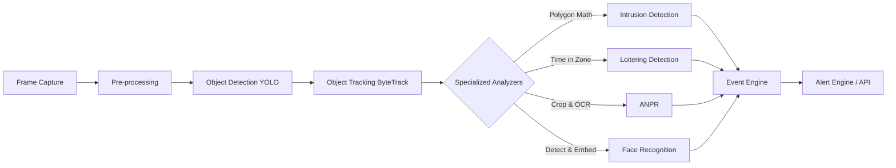

# AI Architecture

## Pipeline Overview

## Modular Interfaces

To ensure the AI subsystem remains flexible, extensible, and SIH prototype-friendly, components use abstract base classes (ABCs in Python).

### 1. Object Detection (`BaseDetector`)
- **Input**: Raw Image Frame (NumPy array)
- **Output**: List of Detections (Bounding Boxes [x1, y1, x2, y2], Classes, Confidences)
- **Implementation**: `YOLOv8Detector` (Wraps Ultralytics model). Replaceable by lightweight models for edge devices.

### 2. Object Tracking (`BaseTracker`)
- **Input**: Detections, Frame
- **Output**: Tracked Objects (ID, Box, Class, Velocity)
- **Implementation**: `ByteTrackWrapper`. Responsible for assigning consistent IDs to objects across frames.

### 3. Analytics Modules (`BaseAnalyzer`)
Analyzers receive the tracked objects and current frame to evaluate specific rules.
- **IntrusionAnalyzer**: Checks if the center or bottom-center of a bounding box crosses into a restricted polygon using Ray Casting or Shapely.
- **LoiteringAnalyzer**: Maintains a memory of how many consecutive frames/seconds an ID remains within a specified zone.
- **NightMovementAnalyzer**: Conditionally activated based on time. Can use frame differencing if deep learning fails in low light.
- **ANPRAnalyzer**: Conditionally activated if object is a 'car/truck'. Crops the bounding box, runs Plate Detection, then OCR (EasyOCR).
- **FaceAnalyzer**: Conditionally activated if object is 'person'. Runs a face detection cascade/RetinaFace and extracts embeddings.
- **SuspiciousActivityAnalyzer**: A rules-based engine combining outputs (e.g., Vehicle stopped + Person exits vehicle + Night time).

### 4. Event Engine
Aggregates boolean triggers or extracted data from Analyzers. 
- Implements **Cooldowns**: E.g., Do not send an intrusion alert for Track ID #45 more than once every 30 seconds.
- Packages data into a standardized `Event` dictionary.
- Passes the Event to the Backend API (via message queue, Redis, or direct async call).

### Replaceability
Because each module adheres to an interface, swapping YOLOv8 for a lightweight MobileNet (for edge devices) or testing a different tracker only requires creating a new class that implements the base interface, without modifying the tracking, analytics, or event logic.
