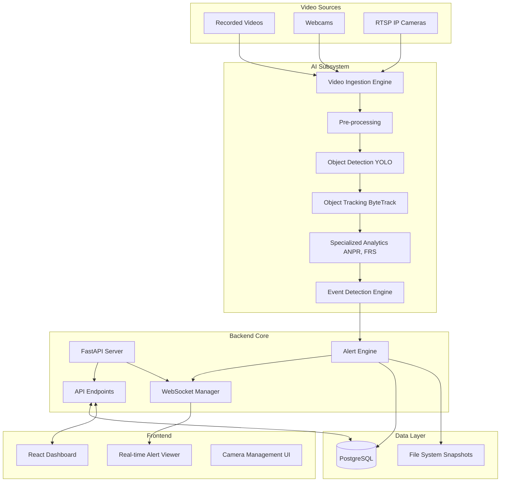

# IBVAP Architecture

## Overall Architecture

IBVAP (Intelligent Border Video Analytics Platform) is a software-defined surveillance platform designed to ingest video streams (initially recorded MP4s/webcams, later RTSP IP cameras), process them using AI for security analytics, and present actionable alerts via a centralized dashboard.

The architecture is divided into three main tiers:
1. **Frontend (Presentation Layer)**: React, Vite, Tailwind CSS.
2. **Backend (Application Layer)**: FastAPI (Python), handling business logic, API routing, WebSockets, and orchestration.
3. **AI/Processing Subsystem**: Independent, modular Python workers utilizing OpenCV, Ultralytics YOLO, and specialized trackers/models.
4. **Data Layer**: PostgreSQL (relational data) and local file storage (evidence snapshots/video clips).

## Component Architecture

## AI Processing Flow
The AI pipeline is designed as a sequential, modular pipeline:
1. **Frame Extraction**: Grabbing frames from the video source.
2. **Detection**: YOLO models detect humans, vehicles.
3. **Tracking**: ByteTrack assigns persistent IDs to detected objects across frames.
4. **Analytics**: Zonal checks (virtual fence), OCR (ANPR), Face Detection applied conditionally based on tracked objects.
5. **Event Generation**: When rule conditions are met (e.g., person crosses fence), an Event is passed to the Alert Engine.

## Real-Time Alert Flow
When the Event Detection Engine triggers an event:
1. Snapshot is saved to disk.
2. Event is logged in PostgreSQL via SQLAlchemy.
3. The Alert Engine broadcasts the event to connected frontend clients via WebSockets.
4. Frontend displays toast notification and updates the alerts feed.

## Multi-Camera Architecture
- Each camera stream is processed by a dedicated worker process or thread to prevent blocking the main server.
- A central Camera Manager keeps track of active streams and their statuses.
- Configuration (zones, rules) is loaded per camera from the database upon stream initialization.

## Future RTSP Architecture
The abstraction allows swapping the `cv2.VideoCapture` source from a local file path to an RTSP URL. Network resilience, stream reconnection logic, and frame dropping (to maintain real-time processing if inference lags) will be handled in the Video Ingestion Engine.

## Edge/Server Deployment Concept
- **Edge Deployment**: AI subsystem can run on edge nodes (e.g., localized servers at border outposts).
- **Central Server**: Receives processed metadata and alerts from edge nodes, rather than raw video, conserving bandwidth.

## Security Considerations
- JWT-based authentication for APIs.
- Environment variables for all secrets and database credentials.
- Role-Based Access Control (RBAC) for dashboard (Admin vs. Operator).
- Sanitization of file uploads/paths.
